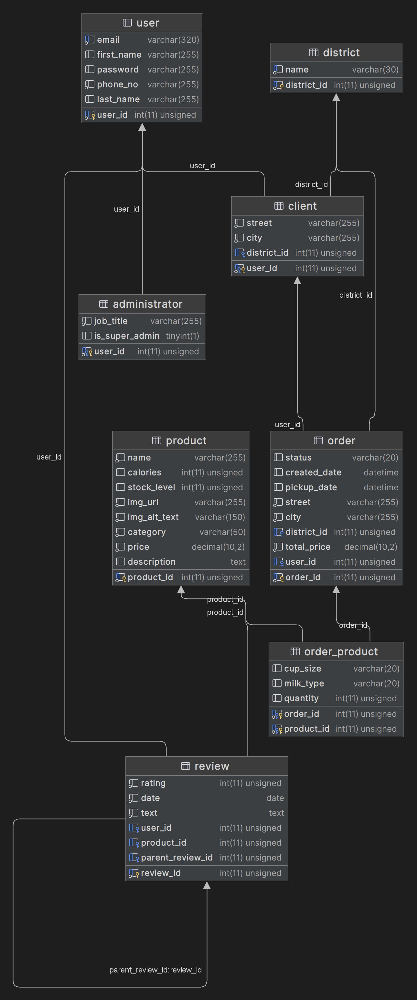

# Database Design

- [Database Design](#database-design)
  - [Schema diagram](#schema-diagram)
  - [Tables](#tables)
    - [user](#user)
    - [administrator](#administrator)
    - [client](#client)
    - [order](#order)
    - [order\_product](#order_product)
    - [review](#review)
    - [product](#product)
    - [district](#district)
  - [Triggers](#triggers)
    - [Update stock level](#update-stock-level)

## Schema diagram

## Tables

### user

| Attribute | Description         | Data Type    | Constraints                                    |
| --------- | ------------------- | ------------ | ---------------------------------------------- |
| user_id   | ID of User          | INT(11)      | PRIMARY KEY, auto-increment                    |
| email     | Email address       | VARCHAR(320) | UNIQUE, NOT NULL, Must match the pattern %@%.% |
| name      | User's name         | VARCHAR(255) | NOT NULL                                       |
| password  | Hashed password     | VARCHAR(255) | NOT NULL, Must be greater than 8 characters    |
| phone_no  | User's phone number | VARCHAR(20)  | NOT NULL, Must be greater than 6 characters    |

### administrator

| Attribute     | Description                                       | Data Type    | Constraints                                       |
| ------------- | ------------------------------------------------- | ------------ | ------------------------------------------------- |
| user_id       | ID of administrator                               | INT(11)      | PRIMARY KEY, FOREIGN KEY REFERENCES user(user_id) |
| job_title     | Job title of administrator                        | VARCHAR(255) | NOT NULL, Must have length > 0                    |
| is_superadmin | Whether the administrator is a super admin or not | TINYINT(1)   | DEFAULT false                                     |

### client

| Attribute   | Description             | Data Type    | Constraints                                       |
| ----------- | ----------------------- | ------------ | ------------------------------------------------- |
| user_id     | ID of client            | INT(11)      | PRIMARY KEY, FOREIGN KEY REFERENCES user(user_id) |
| street      | Client's street address | VARCHAR(255) | NOT NULL, Must have length > 0                    |
| city        | Client's city           | VARCHAR(255) | NOT NULL, Must have length > 0                    |
| district_id | Client's district       | INT(11)      | FOREIGN KEY REFERENCES district(district_id)      |

### order

| Attribute    | Description                 | Data Type     | Constraints                                   |
| ------------ | --------------------------- | ------------- | --------------------------------------------- |
| order_id     | ID of order                 | INT(11)       | PRIMARY KEY, auto-increment                   |
| status       | Order status                | VARCHAR(20)   | Must be one of: pending, cancelled, completed |
| created_date | Date the order was created  | DATETIME      |                                               |
| pickup_date  | Date of the order pickup    | DATETIME      | Set to NULL when the client place the order   |
| street       | Delivery street address     | VARCHAR(255)  | NOT NULL, Must have length > 0                |
| city         | Delivery city               | VARCHAR(255)  | NOT NULL, Must have length > 0                |
| district_id  | Delivery district           | INT(11)       | FOREIGN KEY REFERENCES district(district_id)  |
| total_price  | Total price of the order    | DECIMAL(10,2) | NOT NULL, total_price is >= 0                 |
| user_id      | ID of user who placed order | INT(11)       | FOREIGN KEY REFERENCES client(user_id)        |

### order_product

| Attribute  | Description             | Data Type   | Constraints                                             |
| ---------- | ----------------------- | ----------- | ------------------------------------------------------- |
| order_id   | ID of order             | INT(11)     | PRIMARY KEY, FOREIGN KEY REFERENCES order(order_id)     |
| product_id | ID of product           | INT(11)     | PRIMARY KEY, FOREIGN KEY REFERENCES product(product_id) |
| quantity   | Quantity of the product | INT(11)     | NOT NULL, quantity > 0 (cannot be 0)                    |
| cup_size   | Cup size of the product | VARCHAR(20) | Must be one of: `small`, `medium`, `large`              |
| milk_type  | Type of milk            | VARCHAR(20) | Must be one of: `almond`, `coconut`, `oat`, `soy`       |

### review

| Attribute        | Description           | Data Type | Constraints                                                  |
| ---------------- | --------------------- | --------- | ------------------------------------------------------------ |
| review_id        | ID of review          | INT(11)   | PRIMARY KEY, auto-increment                                  |
| rating           | Rating of the product | INT(11)   | Must be between 1 and 5 inclusive                            |
| date             | Date of the review    | DATE      | NOT NULL                                                     |
| text             | Review text           | TEXT      | NOT NULL                                                     |
| user_id          | ID of user            | INT(11)   | FOREIGN KEY REFERENCES client(user_id)                       |
| product_id       | ID of product         | INT(11)   | FOREIGN KEY REFERENCES product(product_id)                   |
| parent_review_id | Parent review ID      | INT(11)   | NULL only when a review is a top-level comment , FOREIGN KEY |
|                  |                       |           | REFERENCES review(review_id)                                 |

### product

| Attribute    | Description                | Data Type     | Constraints                               |
| ------------ | -------------------------- | ------------- | ----------------------------------------- |
| product_id   | ID of product              | INT(11)       | PRIMARY KEY, auto-increment               |
| name         | Name of the product        | VARCHAR(255)  | NOT NULL                                  |
| calories     | Calories per serving       | INT(11)       | Must be non-negative                      |
| stock_level  | Current stock level        | INT(11)       | NOT NULL, Must be non-negative            |
| img_url      | URL of the product         | VARCHAR(255)  | Must end with `.png`, `.jpeg`, or `.avif` |
| img_alt_text | Alternative text for image | VARCHAR(150)  | Must be between 5 and 150 characters      |
| category     | Category of the product    | VARCHAR(50)   | NOT NULL, Must have length > 0            |
| price        | Price of the product       | DECIMAL(10,2) | NOT NULL                                  |
| description  | Description of the product | TEXT          | NOT NULL, Must have length > 0            |

### district

| Attribute   | Description   | Data Type   | Constraints                                          |
| ----------- | ------------- | ----------- | ---------------------------------------------------- |
| district_id | District ID   | INT(11)     | PRIMARY KEY, auto-increment                          |
| name        | District name | VARCHAR(30) | Must be one of: `Moka`, `Port Louis`,                |
|             |               |             | `Flacq`, `Curepipe`, `Black River`, `Savanne`,       |
|             |               |             | `Grand Port`, `Riviere du Rempart`, `Pamplemousses`, |
|             |               |             | `Mahebourg`, `Plaines Wilhems`                       |

## Triggers

### Update stock level

The trigger `UpdateStockLevel` is set to execute after each insertion operation on the `order_product` table. It
functions to automatically adjust the stock level of products following an order placement. Specifically, it decreases
the stock level of the products included in the order based on the quantity ordered. There are no additional constraints
or conditions applied to this trigger.