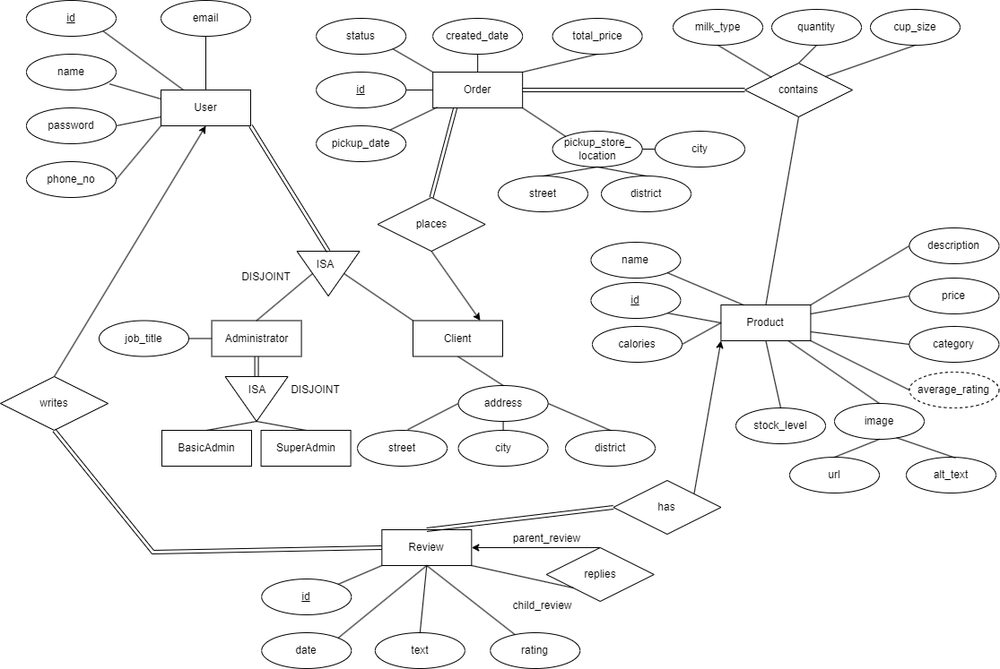

# Software Requirements Specification

## For Steamy Sips

Prepared by creme332 and Jokhoo

Version 1.0

Table of Contents
=================
- [Software Requirements Specification](#software-requirements-specification)
  - [For Steamy Sips](#for-steamy-sips)
- [Table of Contents](#table-of-contents)
  - [Introduction](#introduction)
    - [Purpose](#purpose)
    - [Product Scope](#product-scope)
    - [Document Conventions](#document-conventions)
  - [Overall Description](#overall-description)
    - [Product Perspective](#product-perspective)
    - [User Classes and Characteristics](#user-classes-and-characteristics)
    - [Product Functions](#product-functions)
  - [User Requirements](#user-requirements)
    - [Visitor](#visitor)
    - [Client](#client)
    - [Administrator](#administrator)
    - [Super Administrator](#super-administrator)
  - [Use Case Diagram](#use-case-diagram)
  - [Entity Relationship Diagram](#entity-relationship-diagram)
  - [Non-functional Requirements](#non-functional-requirements)
    - [Security](#security)
    - [SEO](#seo)
    - [Software Quality Attributes](#software-quality-attributes)
  - [References](#references)

## Introduction

### Purpose

The purpose of this document is to specify the software requirements for the e-commerce platform
developed for Steamy Sips. This document serves as a comprehensive guide outlining the functional and non-functional requirements necessary for the successful design, development, and deployment of the e-commerce system.

### Product Scope

The system will cover product browsing, user accounts, shopping cart management, secure transactions, order processing, and administrative functionalities.

### Document Conventions

| Abbreviation | Definition                          |
| ------------ | ----------------------------------- |
| ERD          | Entity Relationship Diagram         |
| SEO          | Search Engine Optimization          |
| SRS          | Software Requirement Specifications |
| UML          | Unified Modelling Language          |

## Overall Description

### Product Perspective

Steamy Sips, a local coffee business renowned for its quality coffee and numerous retail shops scattered across the country, recognizes the challenges posed by long queues at its physical stores. In
response, the business is eager to introduce an e-commerce platform as specified in this SRS. This
platform is conceived to establish an efficient and user-friendly online presence for Steamy Sips, facilitating the online sale of coffee products.
The goal is to empower customers to conveniently order their favorite coffee online and streamline the pickup process at the store.

### User Classes and Characteristics

The system will support four types of users:
1. **Visitors**: Visitors are individuals who navigate the system without registering or logging in.
   They have access to basic information on the landing page and can explore the available features without personalized interactions.
2. **Clients**: Clients are users who have registered accounts on the platform. They can log in
   to access personalized features, make purchases, and utilize functionalities tailored to their
   preferences.
3. **Administrators**: Administrators of the system will be employees responsible for managing
   the e-commerce platform. They have access to backend functionalities for order processing,
   inventory management, and user management.
4. **Super administrators**: Super administrators will be responsible for managing administrator
   accounts. An example of a super administrator is the business owner.

### Product Functions

The e-commerce platform is designed to perform a range of major functions, providing users with
a seamless and enjoyable shopping experience. A high-level summary of the functionalities includes:

- User registration and authentication
- Product browsing and search
- Product details and reviews
- Shopping cart management
- Order history and tracking
- User account management
- Administrator functions

## User Requirements

### Visitor

Visitors should be able to:

- View the landing page of the company.
- Browse the menu and access details such as ingredients, prices and availability.
- Search for specific coffee items.
- Filter products by price, category, or customer review rating.
- View their shopping cart at any point in time before checkout.
- Manage their shopping cart by adding and removing items.
- Customize their order (e.g., choose size, type of milk, add or remove ingredients) at any point in time before checkout.
- Choose the store location where they want to pick up their order.
- View product reviews.
- Filter product reviews by verified purchase.
- Create a user account to become a registered user.

### Client

Clients should be able to:

- Do everything that visitors can.
- Log in to their account.
- Log out of their account.
- View their profile and their personal details.
- Edit their personal details on their profile page.
- Permanently delete their account.
- View their order history.
- Cancel a pending order.
- Reorder a previous order.
- Confirm their purchase and checkout.
- Write a review for any product.
- Comment under any product review.
- Receive an email notification after placing an order.

### Administrator

Administrators should be able to:

- Log in to the admin system.
- Log out from the admin system.
- View a dashboard that displays visual representations of sales trends and highlights popular items.
- Manage the menu by adding, updating, or removing coffee items, along with their details.
- View the details of any order.
- Search for orders by customer name.
- Update the status of orders (e.g., confirmed, in-progress, delivered).
- Send emails to clients about special promotions, discounts, or important updates.
- Respond to client reviews.
- Delete client reviews.
- Print a report with sales trends and other key performance indicators.

### Super Administrator

Super Administrators should be able to:

- Do everything that administrators can.
- View details about all admin accounts.
- Create a new administrator account.
- Edit details of an administrator account.
- Delete an administrator account.

## Use Case Diagram

## Entity Relationship Diagram

## Non-functional Requirements

### Security

- Password Policy: The system shall enforce a password policy, including minimum length and
  complexity.
- Password Hashing: User passwords shall be securely hashed using industry-standard cryptographic hash functions such as bcrypt.
- User Authorization: Access to sensitive functionalities, such as order processing and administrative functions, shall be restricted based on user roles and permissions.

### SEO

- The e-commerce store should be optimized for search engines to enhance visibility and ranking in search results.
- Page URLs, meta tags, and content should be structured in accordance with SEO best practices.
- Images and multimedia content should be appropriately tagged and described for improved search engine indexing.
- The administrator website should not be visible in search engine results.

### Software Quality Attributes

- **Accessibility**: The platform must be designed to be mobile-responsive, ensuring optimal user experience and functionality across a variety of mobile devices, including smartphones and tablets.
- **Interoperability**: The platform shall integrate seamlessly with common web browsers, including Chrome, Firefox, Safari, and Edge.
- **Page Load Time for Key Pages**: Key pages, including the homepage, product pages, and checkout, shall load within 3 seconds.

## References

1. Montoya J., SRS-Template, 2019. https://github.com/jam01/SRS-Template [online]. Accessed on 30 January 2024.